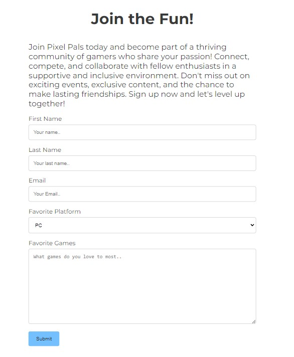

Issue with hero image added .. instead of assets.
issue with placement of nav bar, when to love running to see how to get it on same line.
issue with pushing through git, started new repository under correct template.

links used w3 school to help with form
insperation from love running project for header and nav bar
used https://redketchup.io/color-picker to help find match color values on logo and submit button
https://convertio.co/ for jpeg to web.d
https://www.maps.ie/ for map location

# Pixel Pals
## A website built for a fictional online gaming community.
### MS1 - Niall Pierce

The primary goal of Pixel Pals is to foster an inclusive environment where gamers of all levels can find camaraderie, share their experiences, and learn from one another. It aims to create a space where friendships are formed, teamwork is celebrated, and everyone feels welcome and valued, regardless of their background or gaming expertise. Pixel Pals is about building a supportive community where members can grow together, share their passion, and celebrate their love for gaming in a respectful environment.

## Features 

- __Navigation Bar__

  - This section includes fully reponsive internal links to take the users to each part of the page which includes Home, About Us, Sign Up and Contact Us. The bar remains in place while the users scrolls down.
  - This will allow the user ease of access to any section of the page in the click of a button.
  - Keeping it white at the top allowed for it stand out more against the black background when the user first visits the page.

- __Hero image & slogan__

  - A simple image of a game controller at the top of the page to catch the users eye and let them know its a gaming website.
  - The slogan was added "Game Together, Laugh Forever" to signify its a community site to give a clearer picture of the sites intentions.

- __About Us__

  - The about us section lets the user know who Pixel Pals are, what is our goal, what we offer and a welcome message urging them to join
  - The goal here was to give as much information as possible with out it being too text heavy.

  

- __Video__

  - Adding a video as opposed to an image in this section allowed to showcase the goals of the website by showing the community value.
  - Displaying a ground of friends getting together, having fun and playing video games.
  - The video is set to muted and to loop but also has controls to allow users to pause it if they wish.

  

- __Flip Cards__

  - The Flip Cards were added to be able to answer some initial questions the user might have in a fun and interactive way.
  - They contain a hover over, so that when they are moused over the answer to the questions is revealed on the other side of the cards.

  
  

- __Sign Up__

  - Sign Up section starts with text for a brief description of the benifits of joining.
  - It then uses a form lay-out for the user to input their details Name, Surname, Email and Text Box for more info
  - Each part excluding the text box is required in order to submit the form correctly and the email must contain a email address. 
  - A drop down menu was also added allowing the user to select their favorite platform. 

  

- __Contact Us__

  - The Contact Us section has a small explanation on how to contact Pixel Pals.
  - Following that there is a list marked by icons with the information needed.
  - An Iframe was added to include a google map to show a location also. 

  
  
- __Footer__

  - The Footer contains clickable links that will open in a new tab to bring the user to any of our social medias.
  - It includes links to Facebook, X(Twitter), Youtube and Discord (Widely used in the gaming community).

  

### Future Features 

- Some features I'd like to add in the future would be to add a page going into more detail about upcoming events and tournaments.
- Another page with more information on give aways and include a gallery. 

## Testing 

- Tested Nav Menu to make sure that the users would be brought to the correct location and not brought there within a new tab.
- Tested Video to make sure it was on an loop and more importantly that the user had the control over the video and could pause and play as they wished.
- Tested Flip Cards with mousing over each of them so that they worked as intended and rotated correctly.
- Tested the Sign Up section so that each section would be required in order to submit the form. I also made sure that Email Address was required as email so that the user would have to enter a valid email address to proceed and I also tested the drop down menu so that it would and displayed the correct content.
- Tested Google Map in Contact Us section to make sure it could be moved correctly by the user.

### Bugs

- When positioning the video, the width kept pushing the screen out to right on medium to small screens. Corrected this by adjusting size to 100% on each Media
- Nav bar wouldn't spread across the top, I used the Love Running site to help me space evenly.
- An incorrect pathing to the main hero image wasn't loading it. Adjusted pathing to fix this. 

### Smaller Screens

- Different media queries allowed me to make sure the site worked and fit correctly. I adjusted the video to sit below the About Us section on smaller screen and the Flip Cards to sit in a column.

- Medium to Large Laptops the Flip Cards are kept in a row while the video is still moved top the bottom of About Us section.

### Validator Testing 

- HTML
  - No errors were returned when passing through the official [W3C validator](https://validator.w3.org/nu/?doc=https%3A%2F%2Fcode-institute-org.github.io%2Flove-running-2.0%2Findex.html)
  
- CSS
  - No errors were found when passing through the official [(Jigsaw) validator](https://jigsaw.w3.org/css-validator/validator?uri=https%3A%2F%2Fvalidator.w3.org%2Fnu%2F%3Fdoc%3Dhttps%253A%252F%252Fcode-institute-org.github.io%252Flove-running-2.0%252Findex.html&profile=css3svg&usermedium=all&warning=1&vextwarning=&lang=en#css)

## Deployment 

- The site was deployed to GitHub pages. The steps to deploy are as follows: 
  - In the GitHub repository, navigate to the Settings tab 
  - From the source section drop-down menu, select the Master Branch
  - Once the master branch has been selected, the page will be automatically refreshed with a detailed ribbon display to indicate the successful deployment. 

The live link can be found here - https://niallpierce.github.io/-Pixel-Pals/