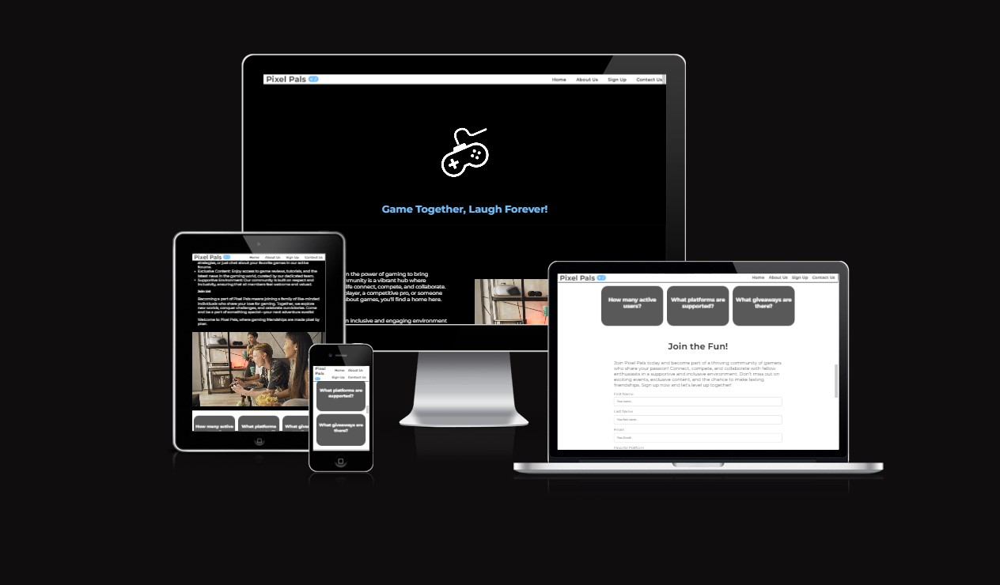
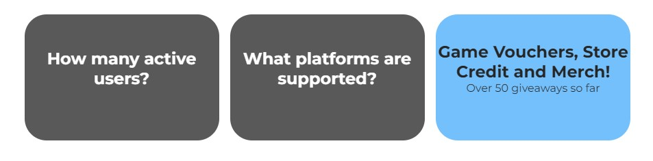

Issue with hero image added .. instead of assets.
issue with placement of nav bar, when to love running to see how to get it on same line.
issue with pushing through git, started new repository under correct template.

links used w3 school to help with form
insperation from love running project for header and nav bar
used https://redketchup.io/color-picker to help find match color values on logo and submit button
https://convertio.co/ for jpeg to web.d
https://www.maps.ie/ for map location

# Pixel Pals

The primary goal of Pixel Pals is to foster an inclusive environment where gamers of all levels can find camaraderie, share their experiences, and learn from one another. It aims to create a space where friendships are formed, teamwork is celebrated, and everyone feels welcome and valued, regardless of their background or gaming expertise. Pixel Pals is about building a supportive community where members can grow together, share their passion, and celebrate their love for gaming in a respectful environment.

## Features 

- __Navigation Bar__

  - This section includes fully reponsive internal links to take the users to each part of the page which includes Home, About Us, Sign Up and Contact Us. The bar remains in place while the users scrolls down.
  - This will allow the user ease of access to any section of the page in the click of a button.
  - Keeping it white at the top allowed for it stand out more against the black background when the user first visits the page.

- __Hero image & slogan__

  - A simple image of a game controller at the top of the page to catch the users eye and let them know its a gaming website.
  - The slogan was added "Game Together, Laugh Forever" to signify its a community site to give a clearer picture of the sites intentions.

- __About Us__

  - The about us section lets the user know who Pixel Pals are, what is our goal, what we offer and a welcome message urging them to join
  - The goal here was to give as much information as possible with out it being too text heavy.

  

- __Video__

  - Adding a video as opposed to an image in this section allowed to showcase the goals of the website by showing the community value.
  - Displaying a ground of friends getting together, having fun and playing video games.
  - The video is set to muted and to loop but also has controls to allow users to pause it if they wish.

  

  - __Flip Cards__

  - The Flip Cards were added to be able to answer some initial questions the user might have in a fun and interactive way.
  - They contain a hover over, so that when they are moused over the answer to the questions is revealed on the other side of the cards.

  
  